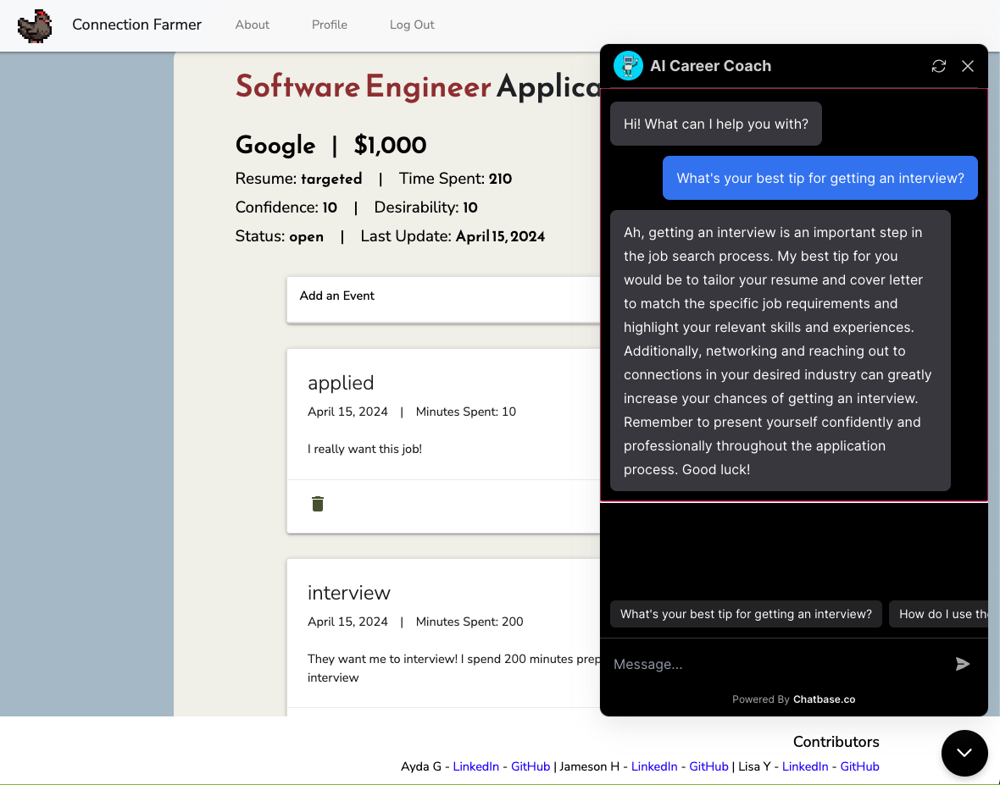

# CONNECTION FARMER
Connection Farmer is a site designed for users to “farm” LinkedIn connections and track job search progress. If you have less than the preferred 500+ connections on your LinkedIn and want to change that, create a profile on this site and farm some connections with random, like-minded strangers!
  
The site also includes a Job Applications Tracker which allows users to add job applications to their profile and track events such as "Submitted Application," "Interview 1," etc., and view said events as a timeline. Users may also add how much time they've spend on each event in the application process, and Connection Farmer will automatically calculate the total time you’ve spent on any given job application process or the total time spent searching for jobs, and it will display these figures on the relevant pages.

# Screenshots
### Home Page

### Index Page

### Profile Page

### Job Details Page (Events Timeline)

### AI Career Coach / Site Navigation Helper

# Technologies Used
- Python
- Postgresql
- Django
- Heroku
- Git/GitHub
- Trello
- VS Code
- HTML
- JavaScript
- CSS
- Materialize CSS
- Bootstrap CSS

# Getting Started
[Click to View Project Planning](https://trello.com/b/ZezyINxc/project-3)
[Click to view Connection Farmer site!](https://connectionfarmer-8077fbac5cc8.herokuapp.com)

# Next Steps
- LinkedIn API integrations
- Have users automatically send LinkedIn connection requests to everyone else on the profiles page without having to click through them all.
- Improve mobile browser support.